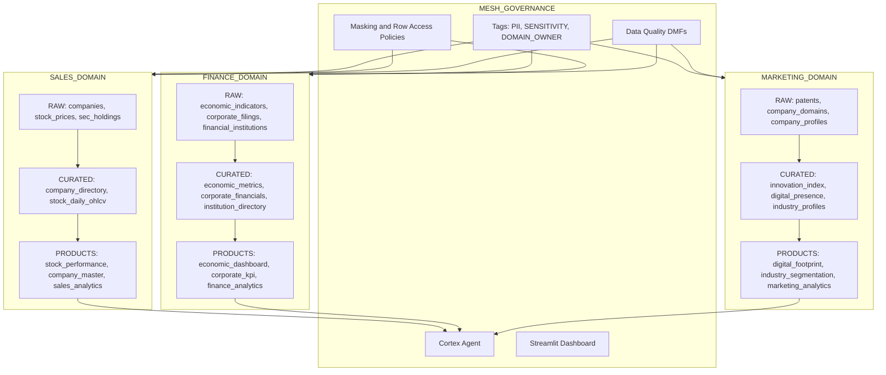

# Project 01: Data Mesh on Snowflake

## The Problem

Most organizations start their data journey with a centralized data warehouse or lake. A small platform team owns everything — ingestion, transformations, quality, access. It works at first. But as the company scales to dozens of domains (Sales, Finance, Marketing, Operations...), the central team becomes a bottleneck. Requests queue up. Context gets lost. Data quality degrades because the people closest to the data don't own it.

**Data Mesh** flips this model: treat data as a product, give ownership to domain teams, provide a self-serve platform, and apply governance federally rather than centrally.

This project implements that philosophy on Snowflake — end to end.

## What I Built

A production-grade data mesh across three business domains (**Sales**, **Finance**, **Marketing**), each with full autonomy over their data lifecycle, backed by centralized governance that enforces security and quality without creating bottlenecks.

```
┌─────────────────────────────────────────────────────────────────────────┐
│                     MESH_GOVERNANCE (Central)                            │
│   Tags · Masking Policies · Row Access · DMFs · Cortex Agent            │
└──────────────────────────────┬──────────────────────────────────────────┘
                               │ applies to all domains
          ┌────────────────────┼────────────────────────┐
          ▼                    ▼                        ▼
    ┌─────────────┐     ┌─────────────┐         ┌─────────────┐
    │   SALES     │     │  FINANCE    │         │  MARKETING  │
    │   DOMAIN    │     │  DOMAIN     │         │  DOMAIN     │
    ├─────────────┤     ├─────────────┤         ├─────────────┤
    │ RAW (land)  │     │ RAW (land)  │         │ RAW (land)  │
    │  ↓ DT       │     │  ↓ DT       │         │  ↓ DT       │
    │ CURATED     │     │ CURATED     │         │ CURATED     │
    │  ↓ Views    │     │  ↓ Views    │         │  ↓ Views    │
    │ PRODUCTS    │     │ PRODUCTS    │         │ PRODUCTS    │
    └──────┬──────┘     └──────┬──────┘         └──────┬──────┘
           │                   │                       │
           └───────────────────┼───────────────────────┘
                               ▼
                    ┌───────────────────────┐
                    │  Cortex Agent (NL Q&A) │
                    │  Streamlit Dashboard   │
                    └───────────────────────┘
```

## The Five Pillars

| Pillar | What it means | How it's implemented |
|--------|---------------|---------------------|
| **Domain Ownership** | Each team owns their data end-to-end | 3 isolated databases, per-domain warehouses, dedicated OWNER/CONTRIBUTOR/READER roles |
| **Data as Product** | Data is discoverable, governed, and has an SLA | Secure views in PRODUCTS schemas with descriptions, cross-domain grants |
| **Self-Serve Platform** | Domain teams build pipelines without a central ticket | 8 Dynamic Tables with declarative SQL — no DAGs, no orchestration code |
| **Federated Governance** | Central policies, domain autonomy | Tags (PII/SENSITIVITY), masking policies, DMFs — defined once, applied everywhere |
| **Semantic Layer** | Business users query with intent, not SQL | 3 Semantic Views + Cortex Agent for natural language analytics |

## Architecture Diagram



## How It Works

### 1. Domain Teams Own Their Data

Each domain has a dedicated database (`SALES_DOMAIN`, `FINANCE_DOMAIN`, `MARKETING_DOMAIN`) with three schemas following the medallion pattern:

- **RAW** — Immutable landing zone. Data arrives here via CTAS from source systems.
- **CURATED** — Dynamic Tables clean, conform, and model the data declaratively.
- **PRODUCTS** — Published secure views that other domains can consume.

Each domain also gets its own X-Small warehouse (auto-suspend 60s) for cost isolation.

### 2. Data Flows Without Orchestration

Instead of scheduling Airflow DAGs or dbt jobs, each domain declares transformations as **Dynamic Tables**:

```sql
CREATE DYNAMIC TABLE SALES_DOMAIN.CURATED.STOCK_DAILY_OHLCV
  TARGET_LAG = '1 hour'
  WAREHOUSE = SALES_WH
AS
SELECT TICKER, DATE,
  MAX(CASE WHEN VARIABLE = 'pre-market_open_adjusted' THEN VALUE END) AS OPEN_PRICE,
  MAX(CASE WHEN VARIABLE = 'all-day_high_adjusted' THEN VALUE END) AS HIGH_PRICE,
  ...
FROM SALES_DOMAIN.RAW.STOCK_PRICES
GROUP BY TICKER, DATE;
```

No scheduler. No DAG. Snowflake handles refresh automatically within the target lag.

### 3. Governance Without Gatekeeping

The central `MESH_GOVERNANCE` database defines policies once:

```sql
-- Tag sensitive columns
ALTER TABLE SALES_DOMAIN.RAW.COMPANIES MODIFY COLUMN EIN
  SET TAG MESH_GOVERNANCE.TAGS.PII = 'SSN';

-- Apply masking — READERs see ***MASKED***, OWNERs see real values
ALTER TABLE SALES_DOMAIN.RAW.COMPANIES MODIFY COLUMN EIN
  SET MASKING POLICY MESH_GOVERNANCE.POLICIES.MASK_PII;
```

Result: A `SALES_READER` querying the same table sees `***MASKED***` while a `SALES_OWNER` sees the real EIN. No application-level filtering needed.

### 4. Cross-Domain Consumption

Finance needs Sales data? They already have it via the RBAC hierarchy:

```sql
USE ROLE FINANCE_OWNER;  -- automatically inherits SALES_READER
SELECT * FROM SALES_DOMAIN.PRODUCTS.STOCK_PERFORMANCE LIMIT 10;
-- Works. Zero-copy. Governed.
```

### 5. Natural Language Access

The Cortex Agent routes questions to the right domain automatically:

> "What are the top 10 stocks by average closing price?" → Sales Analytics
> "How many 10-K vs 10-Q filings are in the data?" → Finance Analytics
> "Which industries have the most companies?" → Marketing Analytics

## RBAC Design

```
ACCOUNTADMIN
  └── MESH_ADMIN (central governance)
       ├── SALES_OWNER ──► SALES_CONTRIBUTOR ──► SALES_READER
       ├── FINANCE_OWNER ──► FINANCE_CONTRIBUTOR ──► FINANCE_READER
       └── MARKETING_OWNER ──► MARKETING_CONTRIBUTOR ──► MARKETING_READER

Cross-domain: Each OWNER inherits other domains' READER roles
SYSADMIN inherits all OWNER roles
```

| Role | Can do |
|------|--------|
| OWNER | Full DDL, publish products, manage team |
| CONTRIBUTOR | Write to RAW/CURATED, create dynamic tables |
| READER | Read PRODUCTS only (masking enforced) |
| MESH_ADMIN | Define tags, policies, DMFs, manage agent |

## Data Sources

All data comes from `SNOWFLAKE_PUBLIC_DATA_FREE` — Snowflake's built-in free dataset with 370 real-world views:

| Domain | Source | What it contains |
|--------|--------|-----------------|
| Sales | COMPANY_INDEX | 10K companies with tickers, CIK, LEI, EIN |
| Sales | STOCK_PRICE_TIMESERIES | Daily OHLCV for equities (2025+) |
| Sales | SEC_13F_INDEX | Institutional investor holdings (13F filings) |
| Finance | FINANCIAL_ECONOMIC_INDICATORS_TIMESERIES | CPI, GDP, employment, mortgage rates |
| Finance | FINANCIAL_INSTITUTION_ENTITIES | 9.5K FDIC-regulated banks |
| Finance | SEC_CORPORATE_REPORT_ATTRIBUTES | XBRL financial KPIs from 10-K/10-Q |
| Marketing | USPTO_PATENT_INDEX | 10K patents with CPC classifications |
| Marketing | COMPANY_DOMAIN_RELATIONSHIPS | 20K company-to-website mappings |
| Marketing | COMPANY_CHARACTERISTICS | Industry, SIC, address, entity type |

## Governance Controls

### Dynamic Masking

| Policy | Behavior | Applied to |
|--------|----------|-----------|
| `MASK_PII` | Full mask: `***MASKED***` | EIN, Filing Manager Name, Address, ZIP, Employer ID |
| `MASK_EMAIL` | Domain only: `***@domain.com` | URLs, web domains |
| `MASK_PHONE` | Partial: `+1 ***..34` | (Available, not currently applied) |

### Data Quality (DMFs)

Attached to all 9 RAW tables with `TRIGGER_ON_CHANGES` schedule:

| DMF | What it checks |
|-----|---------------|
| `DMF_NULL_RATE` | % of NULLs in critical columns |
| `DMF_DUPLICATE_COUNT` | Duplicates on primary key columns |
| `DMF_MAX_DATE` | Freshness (latest record date) |
| `DMF_ROW_COUNT_CHECK` | Empty table detection |

## Tech Stack

| Component | Purpose |
|-----------|---------|
| Snowflake (AWS US West 2) | Core platform |
| Dynamic Tables | Declarative ELT — no orchestrator needed |
| Semantic Views | Business-level data model for NL queries |
| Cortex Agent | Natural language Q&A across all domains |
| Streamlit-in-Snowflake | Interactive governance dashboard |
| Snow CLI | Deployment automation |

## Try It Yourself

### Prerequisites
- Snowflake account (Standard edition or above)
- ACCOUNTADMIN role access
- `SNOWFLAKE_PUBLIC_DATA_FREE` database (auto-provisioned on new accounts)

### Deployment (9 steps)

1. **Roles** — Create MESH_ADMIN + 9 domain roles, wire the hierarchy
2. **Infrastructure** — 4 databases, 3 schemas each, 4 XS warehouses
3. **Governance** — Tags, masking policies, row access, DMFs in MESH_GOVERNANCE
4. **Ingestion** — CTAS from SNOWFLAKE_PUBLIC_DATA_FREE into domain RAW schemas
5. **Pipelines** — 8 Dynamic Tables in CURATED schemas
6. **Products** — Secure views + Semantic Views in PRODUCTS schemas
7. **Policies** — Tag PII columns, attach masking policies, wire DMFs
8. **Agent** — Create Cortex Agent referencing all 3 Semantic Views
9. **Dashboard** — Deploy Streamlit via Snow CLI

### Ask the Agent

Once deployed, ask these questions through the Cortex Agent:

```
"What are the top 10 stocks by average closing price?"
"Show total trading volume by exchange"
"What is the average CPI value by unit?"
"How many 10-K vs 10-Q filings are in the data?"
"Which industries have the most companies?"
"What states have the most registered companies?"
```

## Project Structure

```
project-01-data-mesh/
├── README.md              # This file
├── streamlit_app.py       # Governance dashboard (deployed to SiS)
├── snowflake.yml          # Snow CLI project definition
└── sql/                   # SQL scripts
    ├── 01_roles.sql
    ├── 02_infrastructure.sql
    ├── 03_governance.sql
    ├── 04_ingestion.sql
    ├── 05_dynamic_tables.sql
    ├── 06_products.sql
    ├── 07_policies.sql
    ├── 08_agent.sql
    └── 09_dashboard.sql
```

## What I Learned

- Dynamic Tables eliminate orchestration complexity but require careful change tracking setup (recreating a source table breaks the DT's change stream).
- Snowflake's `INFORMATION_SCHEMA` is the reliable path for metadata queries in SiS — `SHOW` commands wrapped in subqueries don't work in Snowpark.
- The masking policy pattern (role-based CASE) is elegant: define once, enforce everywhere, no application code changes.
- Semantic Views with verified queries significantly improve Cortex Analyst accuracy on domain-specific questions.
- Cross-domain RBAC via role inheritance is cleaner than explicit grants — one hierarchy change propagates everywhere.

## Part of

**[Data Engineering Portfolio](https://github.com/KnowledgeHub-git/Data-Engineering-Portfolio)** — A collection of production-quality data engineering projects demonstrating modern platform design on Snowflake.

---

Built with Snowflake, Cortex Code, and a lot of SQL.
